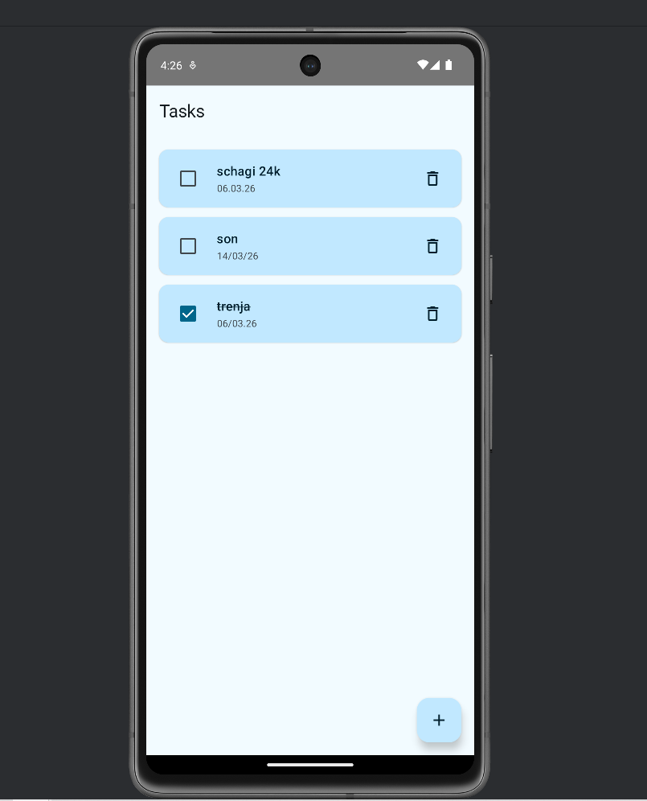
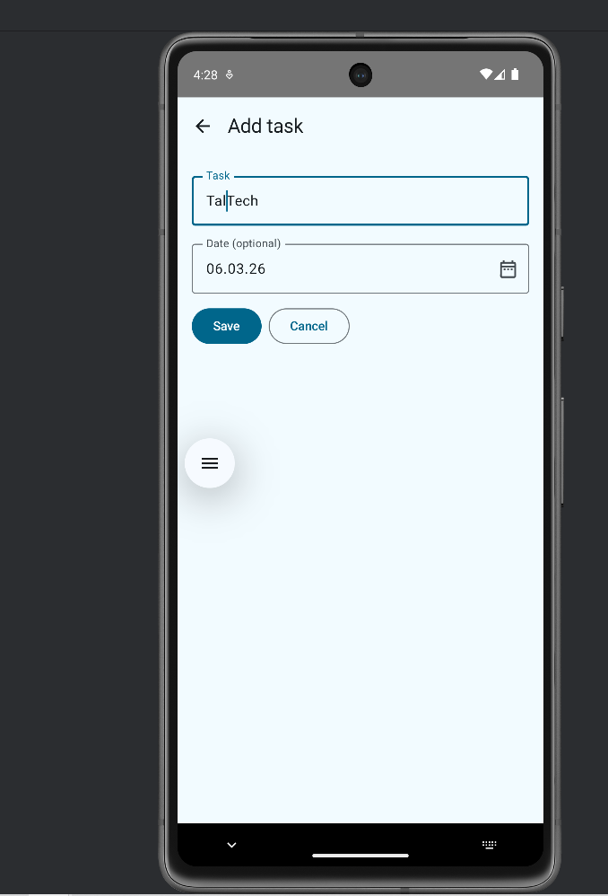
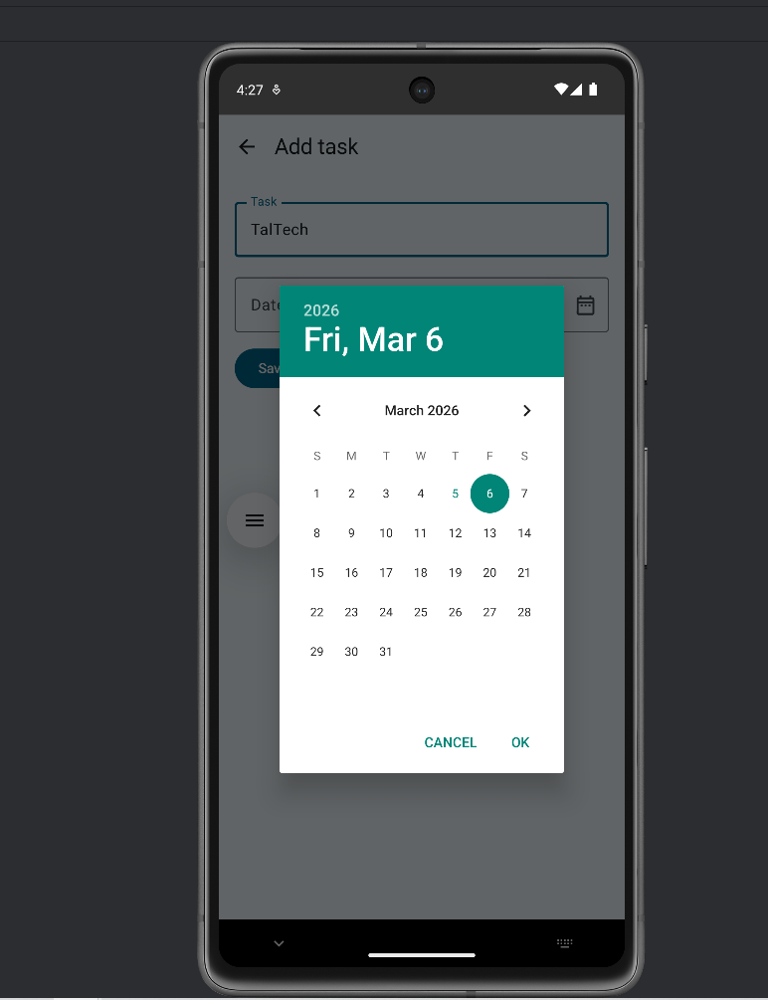

# Ülesanne 1 - Mini Planner (ToDo)

Lihtne Android-rakendus ülesannete (ToDo) haldamiseks.

## Rakendus võimaldab:
- Ülesannete lisamine (tekst + valikuline kuupäev)
- Ülesannete nimekirja kuvamine
- Ülesande märkimine tehtuks (checkbox/switch)
- Ülesande kustutamine

## Tehnoloogia
- Android Studio + Kotlin
- Jetpack Compose (UI)
- Navigation Compose (ekraanide vahel liikumine)
- LazyColumn (nimekirja kuvamine)
- SharedPreferences (andmete salvestus, JSON/Gson) 

## Käivitamine
1. Klooni repositoorium
1. Ava projekt Android Studios
1. Oota Gradle Sync lõpuni
1. Käivita rakendus emulaatoris või seadmes (Run ▶) 

## Meeskond
1. Zinaida Romanova 231803EDTR - geisterin - roll: UI / Layout / Screens
1. Ilona Žakovitš 231818EDTR - zhakki - roll: Logic / Storage / List actions
1. Margus Apinis 231788EDTR - maapin - roll: Documentation / Refactor / QA

## GitHub töövoog
- main haru on stabiilne (otse commit’e ei tehta)
- Arendus toimub feature-harudes ja liitmine main harusse käib Pull Request’i kaudu
- Igal PR-il on kirjeldus ja vähemalt 1 kommentaar teiselt tiimiliikmelt 

## Rakenduse Ekraanipildid
  
  
  
